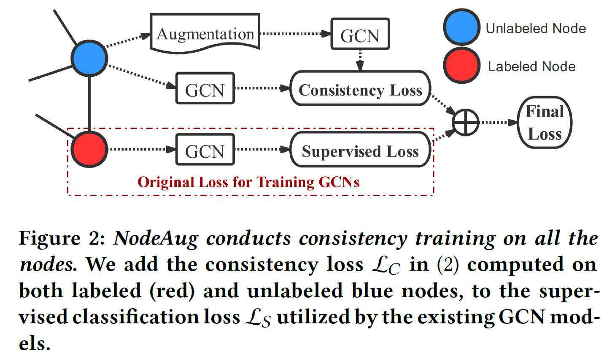

记录一些前沿文献

[Graph Augmentation](#Graph-Augmentation)

+ [Data Augmentation for Graph Neural Networks   AAAI 2021](#Data-Augmentation-for-Graph-Neural-Networks---AAAI-2021)
+ [Graph-Revised Convolutional Network   arXive 2020](#Graph-Revised-Convolutional-Network)
+ [NodeAug: Semi-Supervised Node Classification with Data Augmentation   KDD2020](#NodeAug-Semi-Supervised-Node-Classification-with-Data-Augmentation)

[Graph Equivariant](#Graph-Equivariant)

- [Natural Graph Networks    NIPS 2020](#Natural-Graph-Networks)
- [Invariant and Equivariant Graph Networks    ICLR 2019](#Invariant-and-Equivariant-Graph-Networks)

## Graph Augmentation

###  [Data Augmentation for Graph Neural Networks   AAAI 2021](https://arxiv.org/abs/2010.04740)

[原文](papers/Data-Augmentation-for-Graph-Neural-Networks.pdf)

[代码链接](https://github.com/zhao-tong/GAug)

图增强，主要研究增减边对图数据的影响

Specifically, we discuss how facilitating message passing by removing “noisy” edges and adding “missing” edges that could exist in the original graph can benefit GNN performance, and its relation to intra-class and inter-class edges.

效果：

### [Graph-Revised Convolutional Network](https://arxiv.org/abs/1911.07123)

[原文](papers/Graph-Revised-Convolutional-Network.pdf)

[代码](https://github.com/Maysir/GRCN)

使用一個gcn作爲圖修正模快，一個gcn作爲圖分類模塊，

對於adj預測，在密集图上进行了Knearest-neighbour（KNN）稀疏化处理：对于每个节点，我们将边缘保留为top-K预测分数。  KNN稀疏图的邻接矩阵，表示为S（K），

### [NodeAug Semi-Supervised Node Classification with Data Augmentation](https://bhooi.github.io/papers/nodeaug_kdd20.pdf)

[原文](papers/NodeAug.pdf)

暂无代码

[整体结构](#整体结构)

[主要机制](#主要机制)

[对比实验](#对比效果)

#### **整体结构**

以节点为中心划分为三层（2-hop），子里向外分别为level 1 ~ level 3,级别由高到低，即 level 1 higerer than level 2

#### **主要机制**

- [replacing attributes](#replacing-attributes)
- [removing edges](#removing-edges)
- [adding edges](#adding-edges)
- [subgraph mini-batch training](#subgraph-mini-batch-training)

##### **replacing attributes**

##### **removing edges**

去边时，目的是保留重要的边，去除不重要的边

具有更大**度**的节点倾向于更具影响力。例如，社交网络中的名人往往有很多追随者。

Suppose the degree of the node on its lower end is $𝑑_{𝑙𝑜𝑤}$. We define the score of an edge as:
$$
s_e = log(d_{low})     \qquad (7) 
$$

Suppose the maximum and average edge scores on level 𝑙 are $𝑠 ^{(𝑙)} _{𝑒−max}$ and $𝑠 ^{(𝑙)} _{𝑒−avg}$ respectively.

The probability of removing the edge with score 𝑠𝑒 on level 𝑙 to:
$$
𝑝_{𝑒−𝑟𝑒𝑚} = min \left(
 
𝑝𝑙
\frac{𝑠^{(𝑙 )}
_{𝑒−max} − 𝑠_𝑒}
{𝑠 ^{(𝑙)} _{𝑒−max} - 𝑠 ^{(𝑙)} _{𝑒−avg}}
, 1

\right )

\qquad (8)
$$

##### adding edges

在中心节点与2级和3级的某些节点之间添加边，例如，在引文网络中，论文 A 引用 B，因为它使用 B 中引入的方法 M。然而，M不是B的主要贡献，B引用的论文C提出了M。 然后，在 A 和 C 之间添加边，在不更改其标签的情况下增强 A 的输入要素。
$$
𝑝_{𝑒−add} = min \left(
 
\frac{𝑝}{𝑙}
\frac{
𝑠_n - 𝑠^{(𝑙 )}_{n−min} }
{𝑠 ^{(𝑙)} _{n−ave} - 𝑠 ^{(𝑙)} _{n−min}}
, 1

\right )

\qquad (8)
$$
与图像中增广方法对比：

removing —— cutting

adding —— shearing and resizing, 改变卷积顺序

##### subgraph mini-batch training

#### **对比效果**

## Graph Equivariant

### Natural Graph Networks

[原文](papers/Natural-Graph-Networks.pdf)

代码暂无

### Invariant and Equivariant Graph Networks

[原文](papers/Invariant-and-equivariant-graph.pdf)