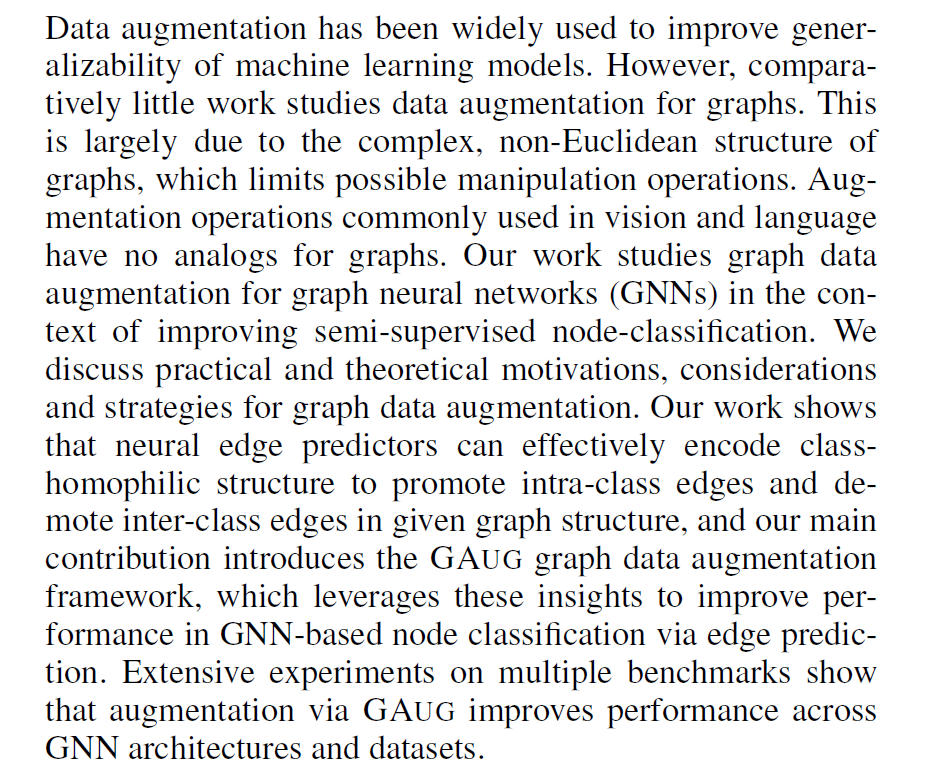
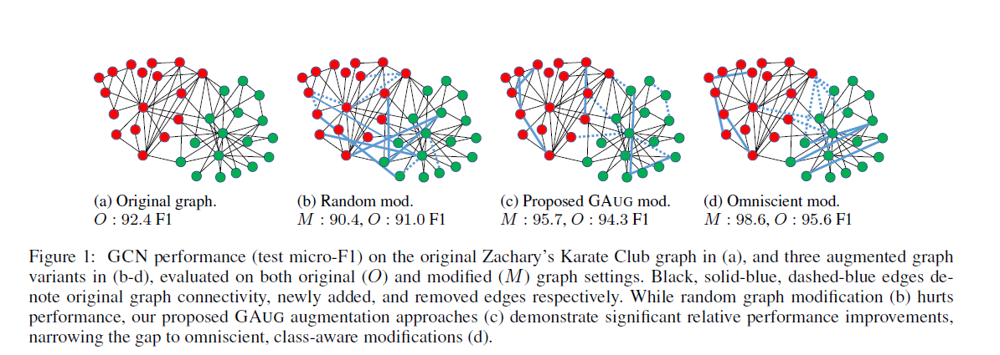
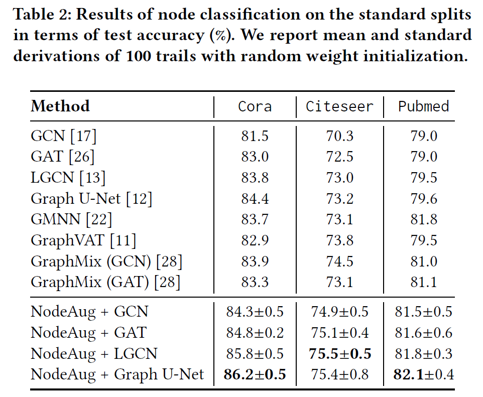
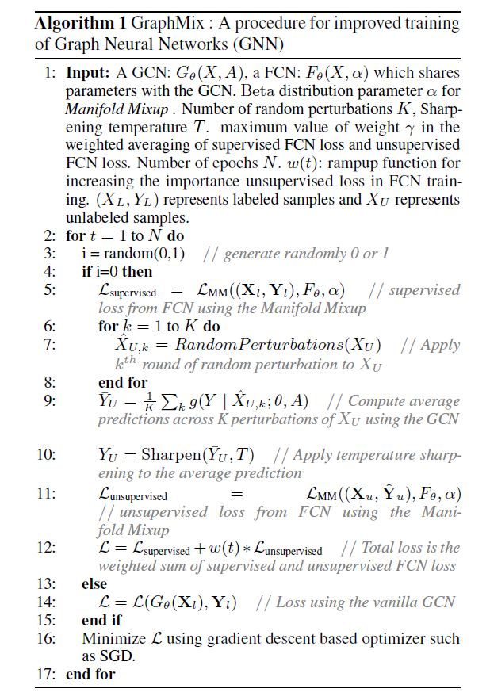
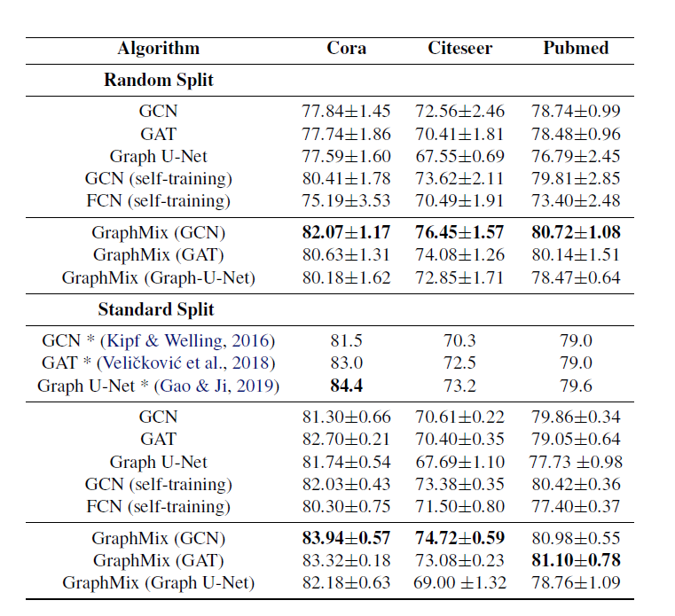
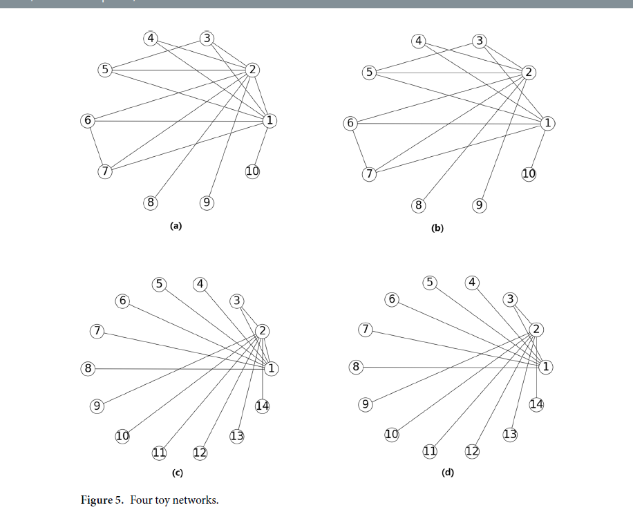
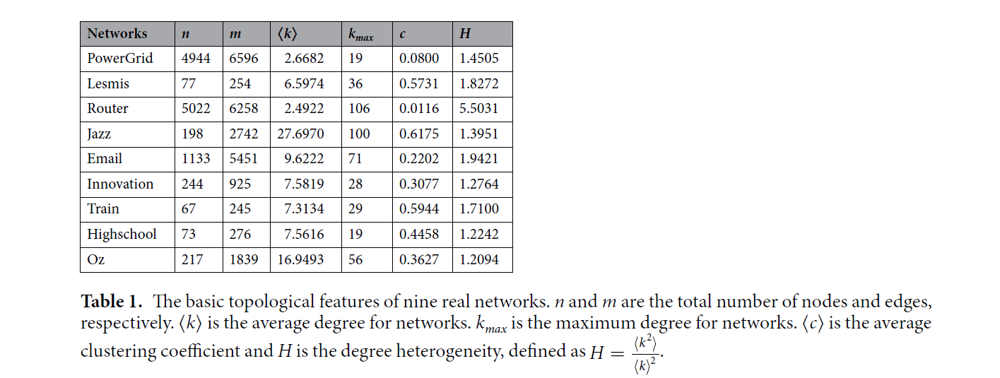
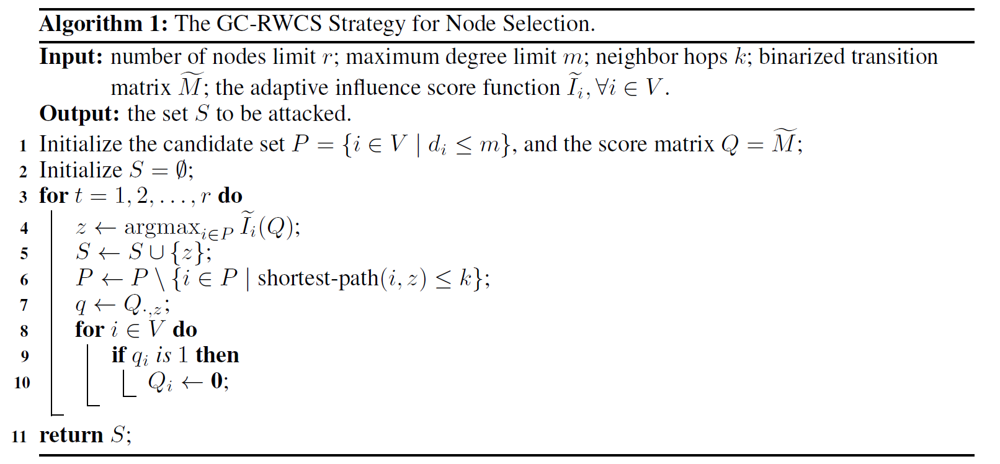

记录一些前沿文献,

***表示还未看


# 目录


[Graph Survey  ***](#Graph-Survey)

- [Artificial Intelligence Index Report 2021       Stanford University HAI](#Artificial-Intelligence-Index-Report-2021)

- [Graph Self-Supervised Learning: A Survey   arXive 2021  ](#Graph-Self-Supervised-Learning:-A-Survey)


[Graph Augmentation](#Graph-Augmentation)

+ [Data Augmentation for Graph Neural Networks   AAAI 2021](#Data-Augmentation-for-Graph-Neural-Networks---AAAI-2021)
+ [Graph-Revised Convolutional Network   arXive 2020](#Graph-Revised-Convolutional-Network)
+ [NodeAug: Semi-Supervised Node Classification with Data Augmentation   KDD2020](#NodeAug-Semi-Supervised-Node-Classification-with-Data-Augmentation)
+ [GraphMix](GraphMix:-Improved-Training-of-Graph-Neural-Networks-for-Semi-Supervised-Learning[)


[Graph Network](#Graph-Network)

- [Graph U-Nets    ICML 2019](#Graph-U-Nets)


[Graph Structures / Generation***](#Graph-Generation)

- [Identifying critical edges in complex networks            Scientific Rrports 2018](#Identifying-critical-edges-in-complex-networks)
- [Struc2vec: Learning Node Representations from Structural Identity     KDD 2017](#Struc2vec:-Learning-Node-Representations-from-Structural-Identity)
- [Representation Learning on Graphs: Methods and Applications        IEEE TCDE 2017](#Representation-Learning-on-Graphs:-Methods-and-Applications)
- [Link Prediction Based on Graph Neural Networks     NIPS 2018](#Link-Prediction-Based-on-Graph-Neural-Networks)
- [Graph similarity scoring and matching      Applied Mathematics Letters 2007](#Graph similarity scoring and matching)
- [Whose Opinion to Follow in Multihypothesis Social Learning? A Large Deviations Perspective     IEEE JSTSP 2015](#Whose-Opinion-to-Follow-in-Multihypothesis-Social-Learning?-A-Large-Deviations-Perspective)


[Graph Equivariant ***](#Graph-Equivariant)

- [Natural Graph Networks    NIPS 2020](#Natural-Graph-Networks)
- [Invariant and Equivariant Graph Networks    ICLR 2019](#Invariant-and-Equivariant-Graph-Networks)
- [E(n) Equivariant Graph Neural Networks   arXive 2021 ***](#E(n)-Equivariant-Graph-Neural-Networks)


[Graph Attack](#Graph Attack)

- [Towards More Practical Adversarial Attacks on Graph Neural Networks    NIPS 2020](#Towards-More-Practical-Adversarial-Attacks-on-Graph-Neural-Networks)


[Recommender Systems](#Recommender-Systems)

- [Factorization Machines      IEEE ICDM 2010](#Factorization-Machines)
- [DeepFM: A Factorization-Machine based Neural Network for CTR Prediction    IJCAI 2017](#DeepFM)


# Graph Survey


### Artificial Intelligence Index Report 2021


### Graph Self-Supervised Learning: A Survey

#### 摘要


# Graph Augmentation


###  [Data Augmentation for Graph Neural Networks   AAAI 2021](https://arxiv.org/abs/2010.04740)

[原文](papers/Data-Augmentation-for-Graph-Neural-Networks.pdf)

[代码链接](https://github.com/zhao-tong/GAug)


#### 摘要




#### 网络结构


图增强，主要研究增减边对图数据的影响

Specifically, we discuss how facilitating message passing by removing “noisy” edges and adding “missing” edges that could exist in the original graph can benefit GNN performance, and its relation to intra-class and inter-class edges.




效果：


### [Graph-Revised Convolutional Network](https://arxiv.org/abs/1911.07123)


[原文](papers/Graph-Revised-Convolutional-Network.pdf)

[代码](https://github.com/Maysir/GRCN)

使用一個gcn作爲圖修正模快，一個gcn作爲圖分類模塊，

對於adj預測，在密集图上进行了Knearest-neighbour（KNN）稀疏化处理：对于每个节点，我们将边缘保留为top-K预测分数。  KNN稀疏图的邻接矩阵，表示为S（K），


### [NodeAug Semi-Supervised Node Classification with Data Augmentation](https://bhooi.github.io/papers/nodeaug_kdd20.pdf)

[原文](papers/NodeAug.pdf)

暂无代码


[整体结构](#整体结构)

[主要机制](#主要机制)

[对比实验](#对比效果)


#### **整体结构**


以节点为中心划分为三层（2-hop），子里向外分别为level 1 ~ level 3,级别由高到低，即 level 1 higerer than level 2


#### **主要机制**

- [replacing attributes](#replacing-attributes)
- [removing edges](#removing-edges)
- [adding edges](#adding-edges)
- [subgraph mini-batch training](#subgraph-mini-batch-training)


##### **replacing attributes**


##### **removing edges**

去边时，目的是保留重要的边，去除不重要的边

具有更大**度**的节点倾向于更具影响力。例如，社交网络中的名人往往有很多追随者。

Suppose the degree of the node on its lower end is $𝑑_{𝑙𝑜𝑤}$. We define the score of an edge as:
$$
s_e = log(d_{low})     \qquad (7) 
$$


Suppose the maximum and average edge scores on level 𝑙 are $𝑠 ^{(𝑙)} _{𝑒−max}$ and $𝑠 ^{(𝑙)} _{𝑒−avg}$ respectively.

The probability of removing the edge with score 𝑠𝑒 on level 𝑙 to:
$$
𝑝_{𝑒−𝑟𝑒𝑚} = min \left(
 
𝑝𝑙
\frac{𝑠^{(𝑙 )}
_{𝑒−max} − 𝑠_𝑒}
{𝑠 ^{(𝑙)} _{𝑒−max} - 𝑠 ^{(𝑙)} _{𝑒−avg}}
, 1

\right )

\qquad (8)
$$


##### adding edges

在**中心节点**与**2级和3级的某些节点**之间添加边，例如，在引文网络中，论文 A 引用 B，因为它使用 B 中引入的方法 M。然而，M不是B的主要贡献，B引用的论文C提出了M。 然后，在 A 和 C 之间添加边，在不更改其标签的情况下增强 A 的输入要素。
$$
𝑝_{𝑒−add} = min \left(
 
\frac{𝑝}{𝑙}
\frac{
𝑠_n - 𝑠^{(𝑙 )}_{n−min} }
{𝑠 ^{(𝑙)} _{n−ave} - 𝑠 ^{(𝑙)} _{n−min}}
, 1

\right )

\qquad (8)
$$


与图像中增广方法对比：

removing —— cutting

adding —— shearing and resizing, 改变卷积顺序


##### subgraph mini-batch training


#### 实验结果





### GraphMix: Improved Training of Graph Neural Networks for Semi-Supervised Learning


#### 流程：




#### 实验结果：




# Graph Network


## Graph U-Nets

#### 摘要


网络结构：


# Graph Generation


### 补充知识

##### 1.Graph center / Jordan Center

The **center** (or [Jordan](https://en.wikipedia.org/wiki/Camille_Jordan) center[[1\]](https://en.wikipedia.org/wiki/Graph_center#cite_note-WF-1)) of a [graph](https://en.wikipedia.org/wiki/Graph_(discrete_mathematics)) is the set of all vertices of minimum [eccentricity](https://en.wikipedia.org/wiki/Eccentricity_(graph_theory)),[[2\]](https://en.wikipedia.org/wiki/Graph_center#cite_note-2) that is, the set of all vertices *u* where the greatest distance *d*(*u*,*v*) to other vertices *v* is minimal. Equivalently, it is the set of vertices with eccentricity equal to the graph's [radius](https://en.wikipedia.org/wiki/Radius_(graph_theory)).[[3\]](https://en.wikipedia.org/wiki/Graph_center#cite_note-3) Thus vertices in the center (**central points**) minimize the maximal distance from other points in the graph.

This is also known as the **vertex 1-center problem** and can be extended to the [vertex k-center problem](https://en.wikipedia.org/wiki/Vertex_k-center_problem).

Finding the center of a graph is useful in [facility location problems](https://en.wikipedia.org/wiki/Facility_location_problem) where the goal is to minimize the worst-case distance to the facility. For example, placing a hospital at a central point reduces the longest distance the ambulance has to travel.

The center can be found using the [Floyd–Warshall algorithm](https://en.wikipedia.org/wiki/Floyd–Warshall_algorithm).[[4\]](https://en.wikipedia.org/wiki/Graph_center#cite_note-4)[[5\]](https://en.wikipedia.org/wiki/Graph_center#cite_note-5) Another algorithm has been proposed based on matrix calculus.[[6\]](https://en.wikipedia.org/wiki/Graph_center#cite_note-P-6)

The concept of the center of a graph is related to the [closeness centrality](https://en.wikipedia.org/wiki/Closeness_centrality) measure in [social network analysis](https://en.wikipedia.org/wiki/Social_network_analysis), which is the reciprocal of the mean of the distances *d*(*A*,*B*).[[1\]](https://en.wikipedia.org/wiki/Graph_center#cite_note-WF-1)


##### 2.Eigenvector centrality

In [graph theory](https://en.wikipedia.org/wiki/Graph_theory), **eigenvector centrality** (also called **eigencentrality** or **prestige score[[1\]](https://en.wikipedia.org/wiki/Eigenvector_centrality#cite_note-:0-1)**) is a measure of the influence of a [node](https://en.wikipedia.org/wiki/Node_(networking)) in a [network](https://en.wikipedia.org/wiki/Network_(mathematics)). Relative scores are assigned to all nodes in the network based on the concept that connections to high-scoring nodes contribute more to the score of the node in question than equal connections to low-scoring nodes. A high eigenvector score means that a node is connected to many nodes who themselves have high scores.[[2\]](https://en.wikipedia.org/wiki/Eigenvector_centrality#cite_note-2) [[3\]](https://en.wikipedia.org/wiki/Eigenvector_centrality#cite_note-3)

 The eigenvector centrality thesis reads:

> A node is important if it is linked to by other important nodes.

- **Math**

  Let $A = (a_{i,j})$ be the adjacency matrix of a graph. The eigenvector centrality $x_{i}$ of node $i$ is given by: $$x_i = \frac{1}{\lambda} \sum_k a_{k,i} \, x_k$$ where $\lambda \neq 0$ is a constant. In matrix form we have: $$\lambda x = x A$$

  

  Hence the centrality vector $x$ is the **left-hand eigenvector** of the adjacency matrix $A$ associated with the eigenvalue $\lambda$. It is wise to **choose $\lambda$ as the largest eigenvalue in absolute value of matrix $A$.** By virtue of Perron-Frobenius theorem, this choice guarantees the following desirable property: if matrix $A$ is irreducible, or equivalently if the graph is (strongly) connected, then the eigenvector solution $x$ is both unique and positive.

  

  The **power method** can be used to solve the eigenvector centrality problem. Let $m(v)$ denote the signed component of maximal magnitude of vector $v$. If there is more than one maximal component, let $m(v)$ be the first one. For instance, $m(-3,3,2) = -3$. Let $x^{(0)}$ be an arbitrary vector. For $k \geq 1$:

  1. repeatedly compute $x^{(k)} = x^{(k-1)} A$;
  2. normalize $x^{(k)} = x^{(k)} / m(x^{(k)})$;

  until the desired precision is achieved. It follows that $x^{(k)}$ converges to the dominant eigenvector of $A$ and $m(x^{(k)})$ converges to the dominant eigenvalue of $A$. If matrix $A$ is sparse, each vector-matrix product can be performed in linear time in the size of the graph.

  The method converges when the dominant (largest) and the sub-dominant (second largest) eigenvalues of $A$, respectively denoted by $\lambda_1$ and $\lambda_2$, are separated, that is they are different in absolute value, hence when $|\lambda_1| > |\lambda_2|$. The rate of convergence is the rate at which $(\lambda_2 / \lambda_1)^k$ goes to $0$. Hence, if the sub-dominant eigenvalue is small compared to the dominant one, then the method quickly converges.

  **x向量即所有Node的大小，该向量值代表个node的得分，并根据最大的得分归一化**

- **Code**

  The built-in function evcent ([R](http://igraph.org/r/doc/evcent.html), [C](http://igraph.org/c/doc/igraph-Structural.html#igraph_eigenvector_centrality)) computes eigenvector centrality.

  A user-defined function eigenvector.centrality follows:

  ```
  # Eigenvector centrality (direct method)
  #INPUT
  # g = graph
  # t = precision
  # OUTPUT
  # A list with:
  # vector = centrality vector
  # value = eigenvalue
  # iter = number of iterations
  
  eigenvector.centrality = function(g, t) {
    A = get.adjacency(g);
    n = vcount(g);
    x0 = rep(0, n);
    x1 = rep(1/n, n);
    eps = 1/10^t;
    iter = 0;
    while (sum(abs(x0 - x1)) > eps) {
      x0 = x1;
      x1 = as.vector(x1 %*% A);
      m = x1[which.max(abs(x1))];
      x1 = x1 / m;
      iter = iter + 1;
    } 
    return(list(vector = x1, value = m, iter = iter))
  }  
  ```


##### 3. Clique

In the [mathematical](https://en.wikipedia.org/wiki/Mathematics) area of [graph theory](https://en.wikipedia.org/wiki/Graph_theory), a **clique** ([/ˈkliːk/](https://en.wikipedia.org/wiki/Help:IPA/English) or [/ˈklɪk/](https://en.wikipedia.org/wiki/Help:IPA/English)) is a subset of vertices of an [undirected graph](https://en.wikipedia.org/wiki/Undirected_graph) such that every two distinct vertices in the clique are adjacent. That is, a clique of a graph *G* is an [induced subgraph](https://en.wikipedia.org/wiki/Induced_subgraph) of *G* that is [complete](https://en.wikipedia.org/wiki/Complete_graph). Cliques are one of the basic concepts of graph theory and are used in many other mathematical problems and constructions on graphs. Cliques have also been studied in [computer science](https://en.wikipedia.org/wiki/Computer_science): the task of finding whether there is a clique of a given size in a [graph](https://en.wikipedia.org/wiki/Graph_(discrete_mathematics)) (the [clique problem](https://en.wikipedia.org/wiki/Clique_problem)) is [NP-complete](https://en.wikipedia.org/wiki/NP-complete), but despite this hardness result, many algorithms for finding cliques have been studied.

Although the study of [complete subgraphs](https://en.wikipedia.org/wiki/Complete_graph) goes back at least to the graph-theoretic reformulation of [Ramsey theory](https://en.wikipedia.org/wiki/Ramsey_theory) by [Erdős & Szekeres (1935)](https://en.wikipedia.org/wiki/Clique_(graph_theory)#CITEREFErdősSzekeres1935),[[1\]](https://en.wikipedia.org/wiki/Clique_(graph_theory)#cite_note-1) the term *clique* comes from [Luce & Perry (1949)](https://en.wikipedia.org/wiki/Clique_(graph_theory)#CITEREFLucePerry1949), who used complete subgraphs in [social networks](https://en.wikipedia.org/wiki/Social_network) to model [cliques](https://en.wikipedia.org/wiki/Clique) of people; that is, groups of people all of whom know each other. Cliques have many other applications in the sciences and particularly in [bioinformatics](https://en.wikipedia.org/wiki/Bioinformatics).


## **Identifying critical edges in complex networks**

[原文](papers/Identifying-critical-edges-in-complex-networks.pdf)

#### 摘要


提出了一种基于团簇和网络路径的边缘排序算法$BCC_{MOD} (Betweenness Centrality and Clique Model)$。

performs good in identifying critical edges both in network connectivity and spreading dynamic


#### 整体结构

- 目的

  找出网络连接和传播过程中的关键边

- 方法

  基于网络中的团和路径提出BCC方法，
  $$
  BCC_{MOD}(u,v) = \frac{k_u k_v \cdot BC(u,v)}{\sum_{i=3}^n C(u,v)_i}
  $$
  将节点的度、Betweenness centrality、团的概念结合起来，核心思想即：

  - 连接两个度高的节点的边很重要
  - 通过该边的最短路径越多，该边越重要
  - 团(完全子图)的节点数多的子图中，删除边还有很多其他方式到达两个节点，影响较小


#### Related Work

**衡量 Node 的重要性：**

- Node's degree

  Degree centrality, semi-local centrality, k-shell and H-index

- Paths in networks

  Closeness centrality, betweenness centrality and eccentricity centrality

- Eigenvector

  PageRank, LeaderRank and HITs


**衡量 Edge 的重要性：**

- **Degree product** 

  supposes that edges connecting two nodes with high degrees are critical.

- **Betweenness centrality** of edges and betweenness centrality of a group of edges

  suppose that edges linking two connected components are important.

- **Jaccard coefficient**, if node i and node j have a lot of common neighbors, even if they have no direct connection, information also can spread from node i to node j easily,
  so edges are more important if there are less common neighbors.

  Jaccard index  , 又称为Jaccard相似系数（Jaccard similarity coefficient）用于比较有限样本集之间的相似性与差异性。Jaccard系数值越大，样本相似度越高。

- **Edges in the clique** 

  if an edge is removed, information can spread through other edges in clique  which contains the removed edge 

  so, intuitively, edges in smaller cliques are more important.

- The ability to disseminate information

  An edge is important if most of the information is spreading through this edge


**本文：**

​	In this report, we only use the topology of networks to rank the importance of edges, considering not only
the local characteristics (degrees of nodes, cliques) but also the global characteristics (betweenness centrality).


#### 主要机制

##### 1. Betweenness centrality

The more the shortest paths between node pairs pass through the edge e(u, v), the more important the edge e(u, v) is. The betweenness centrality of an edge e(u, v)15 is defined as:
$$
BC(u,v) = \sum_{s \ne t \in V} \frac{\delta_{st}(u,v)}{\delta_{st}}
$$


where $\delta_{st}$ is the number of all the shortest paths between node s and node t, $\delta_{st}(u, v)$  is the number of all the
shortest paths between node s and node t which pass through the edge e(u, v), the larger the score BC is, the more
important the edge is.


##### 2. Edges in the clique

The more important the two related nodes are, the more important the edge is. **On the other hand**, if there are many different cliques containing e(u, v), even e(u, v) is removed, the information also can spread from u to v (or v to u) easily through other edges in these cliques.


##### 3. $BCC_{MOD}$ (Betweenness Centrality and Clique Model)


$$
BCC_{MOD}(u,v) = \frac{k_u k_v \cdot BC(u,v)}{\sum_{i=3}^n C(u,v)_i}
$$
Where BC(u, v) is the betweenness centrality of edge e(u, v), $k_u$ and $k_v$  are the degrees of node u and node v respectively, $C(u, v)_i$ is the number of cliques containing edge e(u, v) (in this report, clique means full connected subgraph, not the maximum full connected subgraph) **whose size being i**. For example $C(u, v)_4 = 3$ means there are three cliques containing edge e(u, v) whose size being 4.**(i 即完全子图中的节点数)**

In this method, the larger the score is, the more important the edge is.

 

For example, as shown in Fig. 5(a,c), the degrees of nodes 1 and 2 are 7 and 8 respectively. In Fig. 5(a) (max size of cliques is 4), $C(1, 2)_3$ is 5 and $C(1, 2)_4$ is 2.(根据每个节点连出来多少个边确定)

When we remove edge e(1, 2), there are also many paths from node 1 to node 2, the effect of spreading is little.
However, in Fig. 5(c) (max size of cliques is 3) with C(1, 2)3 being 1, when we remove edge e(1, 2), the effect of
spreading is large since there is only one path (1, 3, 2) from node 1 to node 2. Table 4 shows the effect probability
$p_e$ of nodes 2, 3, and 9 with the original infected source being node 1 on SIR spreading model with full contact
process. Taking node 2 as an example, in Fig. 5(a,b), its effect probability is 0.3733 and 0.2240 respectively under
μ = 0.2. However, in Fig. 5(c,d), the effect probability of node 2 is 0.2392 and 0.0380 respectively under μ = 0.2.


The Jaccard coefficient of an edge e(u, v) is defined as：
$$
J_{e(u,v)} = \frac{|\Gamma _ u \cap \Gamma_v |}{|\Gamma _ u \cup \Gamma_v |}
$$
where u and v are two related nodes of the edge e(u, v) and $\Gamma _ u$ is the set of $u’s$  neighbors. 

Jaccard相似系数（Jaccard similarity coefficient）用于比较有限样本集之间的相似性与差异性。Jaccard系数值越大，样本相似度越高。

The Bridgeness index of an edge e(u, v) is defined as


#### 实验结果


- 数据集



- 评价指标

  - Susceptibility index S
    $$
    S = \sum _{s<s_{max}} \frac{n_s s^2}{n}
    $$

  

  - The size of giant component σ

  

  

  - SIR spreading model


## Struc2vec: Learning Node Representations from Structural Identity


## Representation Learning on Graphs: Methods and Applications


## Link Prediction Based on Graph Neural Networks


## Graph similarity scoring and matching


#### 摘要


## Whose Opinion to Follow in Multihypothesis Social Learning? A Large Deviations Perspective


# Graph Equivariant


## Natural Graph Networks

[原文](papers/Natural-Graph-Networks.pdf)

代码暂无


## Invariant and Equivariant Graph Networks

[原文](papers/Invariant-and-equivariant-graph.pdf)


## **E(n) Equivariant Graph Neural Networks**

[原文](papers/E(n)-Equivariant-Graph-Neural-Networks.pdf)


#### 摘要


# Graph Attack


### 背景知识

- ##### **对抗攻击**（针对节点分类问题）

  攻击分类：

  - **Happen Time**

    During model Training   ——   **poisoning**(中毒)

    During model Testing     ——   **evasion**(逃避)

  - **Aim**

    Mislead the prediction on specific nodes ——    **targeted attack**

    Damage the overall task performance 	 ——    **untargeted attack**

  - **Attacker’s knowledge aobut the model**

    **white-box attacks** —— full information（model parameters, input data, labels）

    **grey-box attacks**—— partial information（the exact setups vary in a range）

    **black-box**—— input data and sometimes the black-box predictions of the model

    

- ##### **Inductive Bias (归纳偏置)**

  > 机器学习算法在学习过程中对某种假设（hypothesis）的偏好，称为“归纳偏好”（inductive bias），或简称为“偏好”

  例如对一组数据进行拟合的曲线有无数种，其中有的比较“简单”（假设我们认为曲线更平滑意味着“更简单”），有的更复杂。例如一组可以用二次曲线来拟合的数据点，用更复杂的更高阶的曲线也可以拟合，那我们的模型应该选择哪条曲线/假设呢？这就是模型对假设的偏好问题。

  > 所谓的inductive bias，指的是人类对世界的**先验知识**，对应在网络中就是**网络结构**。

  归纳偏差有点像我们所说的先验（Prior），但是有点不同的是归纳偏差在学习的过程中不会更新，但是先验在学习后会不断地被更新。


## Towards More Practical Adversarial Attacks on Graph Neural Networks

[原文](papers/Towards-More-Practical-Adversarial-Attacks-on-Graph-Neural-Networks.pdf)

[代码](https://github.com/Mark12Ding/GNN-Practical-Attack)

#### **摘要**


#### 整体结构

**GC-RWCS** (Greedily Corrected RWCS) strategy




#### 主要机制

- [local constraint on node access](#local-constraint-on-node-access)
- 

利用下试代替loss的该变量，由白盒变为黑盒，使不包含y label
$$
\tilde \delta ^i =C\sum _{j=1} ^N (M^L )_{ji}
$$
小扰动，使用一阶泰勒展开近似


##### local constraint on node access


#### 实验结果


**实验设置：**


# Recommender Systems


## Factorization Machines


## DeepFM