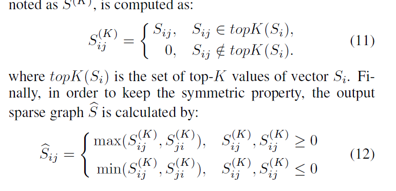
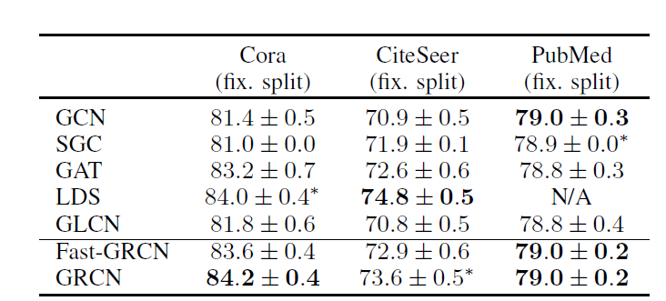

记录一些前沿文献

[Graph Augmentation](#Graph-Augmentation)

+ [Data Augmentation for Graph Neural Networks   AAAI 2021](#Data-Augmentation-for-Graph-Neural-Networks---AAAI-2021)
+ [Graph-Revised Convolutional Network   arXive 2020](#Graph-Revised-Convolutional-Network)
+ [NodeAug: Semi-Supervised Node Classification with Data Augmentation   KDD2020](#NodeAug-Semi-Supervised-Node-Classification-with-Data-Augmentation)

## Graph Augmentation

###  [Data Augmentation for Graph Neural Networks   AAAI 2021](https://arxiv.org/abs/2010.04740)

[原文](papers/Data Augmentation for Graph Neural Networks.pdf)

[代码链接](https://github.com/zhao-tong/GAug)

图增强，主要研究增减边对图数据的影响

Specifically, we discuss how facilitating message passing by removing “noisy” edges and adding “missing” edges that could exist in the original graph can benefit GNN performance, and its relation to intra-class and inter-class edges.

效果：

### [Graph-Revised Convolutional Network](https://arxiv.org/abs/1911.07123)

[原文](papers/Graph-Revised Convolutional Network.pdf)

[代码](https://github.com/Maysir/GRCN)

使用一個gcn作爲圖修正模快，一個gcn作爲圖分類模塊，

對於adj預測，在密集图上进行了Knearest-neighbour（KNN）稀疏化处理：对于每个节点，我们将边缘保留为top-K预测分数。  KNN稀疏图的邻接矩阵，表示为S（K），

### [NodeAug Semi-Supervised Node Classification with Data Augmentation](https://bhooi.github.io/papers/nodeaug_kdd20.pdf)

[原文](papers/NodeAug.pdf)

暂无代码